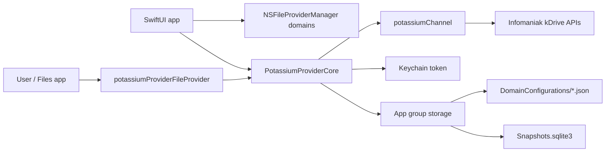

# Architecture

`potassiumProvider` is split into a SwiftUI setup app, a replicated File
Provider extension, and a shared framework that contains kDrive models,
networking adapters, authentication helpers, and persistence.

## Targets

- `potassiumProvider`: SwiftUI app used to connect an account, load kDrives,
  register File Provider domains, and remove configured domains.
- `potassiumProviderFileProvider`: `NSFileProviderReplicatedExtension`
  implementation used by the system to enumerate, fetch, create, modify, trash,
  and delete items.
- `PotassiumProviderCore`: shared framework with domain configuration storage,
  OAuth/keychain storage, kDrive models, kDrive service adapter, snapshot diffing,
  and SQLite snapshot storage.
- `potassiumProviderTests`: Swift Testing unit tests for shared behavior and app
  model flows.
- `potassiumProviderUITests`: XCTest UI automation tests.

## Ownership Boundaries

- The app owns account setup, domain registration, and domain removal.
- The File Provider extension owns Apple's runtime callbacks and maps those
  callbacks to `KDriveFileProviding` operations.
- `PotassiumProviderCore` owns typed provider models, persistence protocols,
  OAuth utilities, and the `PotassiumKDriveService` adapter.
- `potassiumChannel` owns the typed request builders and service calls for
  Infomaniak APIs.
- The app group is the shared storage boundary between app and extension.
- The keychain access group is the shared credential boundary.

## Runtime Flow

At runtime, the extension constructs a `FileProviderRuntime` for each callback.
That runtime loads the domain configuration from the app group, loads and
refreshes the OAuth token from keychain when needed, creates a
`PotassiumKDriveService`, and opens the SQLite snapshot store.

The extension does not keep a long-lived process-level sync engine. Each File
Provider callback performs the work it was asked to do, then returns via Apple's
completion handler.

## Local Reference Tree

`SynchronizingFilesUsingFileProviderExtensions/` is Apple's local sample tree.
It is useful for comparing concepts such as enumeration, domain state, and
conflict handling, but it is not integrated into `potassiumProvider.xcodeproj`
and should not be treated as part of this product's build graph.
