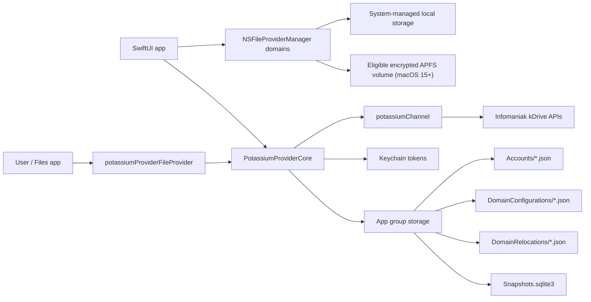

# Architecture

`potassiumProvider` is split into a SwiftUI setup app, a replicated File
Provider extension, and a shared framework that contains kDrive models,
networking adapters, account-scoped authentication helpers, and persistence.

## Targets

- `potassiumProvider`: SwiftUI app used to connect multiple local accounts,
  load kDrives per account, register File Provider domains, remove configured
  domains, choose and change macOS storage placement, repair interrupted moves,
  control Desktop & Documents sync, and log out accounts independently.
- `potassiumProviderFileProvider`: `NSFileProviderReplicatedExtension`
  implementation used by the system to enumerate, fetch, create, modify, trash,
  and delete items, and to provide macOS known-folder locations.
- `PotassiumProviderCore`: shared framework with domain configuration storage,
  OAuth/keychain storage, kDrive models, kDrive service adapter, snapshot diffing,
  SQLite snapshot storage, unified-log categories, durable activity retention,
  and redacted support-log export.
- `potassiumProviderTests`: Swift Testing unit tests for shared behavior and app
  model flows.
- `potassiumProviderUITests`: XCTest UI automation tests.

## Ownership Boundaries

- The app owns account setup, domain registration, external-volume selection and
  eligibility checks, durable relocation/recovery, live placement and
  known-folder state, user-triggered claim/release, domain removal, and
  independent account logout.
- The File Provider extension owns Apple's runtime callbacks and maps those
  callbacks to `KDriveFileProviding` operations. On macOS it also maps Desktop
  and Documents to the selected drive's root-level `Private` directory. For an
  external domain it approves connection only after validating the opaque local
  binding, current volume UUID, and usable same-Mac keychain credentials.
- `PotassiumProviderCore` owns typed provider models, persistence protocols,
  OAuth utilities, and the `PotassiumKDriveService` adapter.
- `potassiumChannel` owns the typed request builders and service calls for
  Infomaniak APIs. The Xcode project requires the published 0.2 release line,
  while `Package.resolved` locks validated builds to potassiumChannel 0.2.0.
- The app group is the shared storage boundary between app and extension.
- The keychain access group is the shared credential boundary. Tokens are keyed
  by local account identifier.

## Domain And Placement Identity

`configurationIdentifier` is the stable app identity for one configured kDrive.
It keys app-group JSON, relocation journals, SwiftUI/status identity, and the
opaque external-domain binding. `domainIdentifier` identifies the current system
domain and can change when storage is recreated; Apple generates it for domains
created with the external-volume initializer. SQLite snapshots and activity are
keyed by this current domain identifier, so a successful move removes the old
domain's rows.

External `NSFileProviderDomain.userInfo` contains only a schema version and the
stable configuration identifier. Account selection and all credentials remain
in the app group/keychain on the Mac. A selected folder is normalized to its
containing volume before the app asks Apple to create the system-managed domain;
no arbitrary user folder becomes part of the provider architecture.

## Runtime Flow

At runtime, the extension constructs a `FileProviderRuntime` for each callback.
A local domain resolves configuration by its current domain identifier. An
external domain decodes its stable configuration binding, then verifies that the
stored current domain identifier and volume UUID match the system domain. The
runtime uses the resulting configuration's `accountIdentifier` to load and
refresh the correct OAuth token from keychain when needed, creates a
`PotassiumKDriveService`, and opens the SQLite snapshot store.

Changing placement is explicitly transactional at the application level rather
than an in-place mutation: stabilize, release known folders when active, prepare
the target, remove the source while preserving dirty data, save/register the
target, clean old domain-keyed rows, and reclaim known folders. The durable
`DomainRelocations` journal is the recovery boundary across crashes and relaunch.

The extension does not keep a long-lived process-level sync engine. Each File
Provider callback performs the work it was asked to do, then returns via Apple's
completion handler.

## Local Reference Tree

`SynchronizingFilesUsingFileProviderExtensions/` is Apple's local sample tree.
It is useful for comparing concepts such as enumeration, domain state, and
conflict handling, but it is not integrated into `potassiumProvider.xcodeproj`
and should not be treated as part of this product's build graph.
