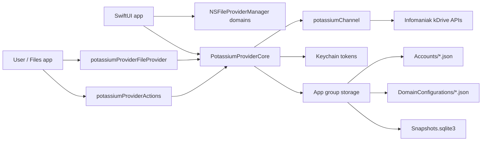

# Architecture

`potassiumProvider` is split into a SwiftUI setup app, a replicated File
Provider extension, a File Provider UI action extension, and a shared framework
that contains kDrive models, networking adapters, account-scoped authentication
helpers, action coordination, and persistence.

```mermaid
flowchart LR
    User["User / Files app"] --> FP["potassiumProviderFileProvider"]
    User --> Actions["potassiumProviderActions"]
    App["SwiftUI app"] --> Domain["NSFileProviderManager domains"]
    App --> Core["PotassiumProviderCore"]
    FP --> Core
    Actions --> Core
    Core --> KC["potassiumChannel"]
    KC --> KDrive["Infomaniak kDrive APIs"]
    Core --> Keychain["Keychain tokens"]
    Core --> AppGroup["App group storage"]
    AppGroup --> Accounts["Accounts/*.json"]
    AppGroup --> DomainJSON["DomainConfigurations/*.json"]
    AppGroup --> Snapshots["Snapshots.sqlite3"]
```

## Targets

- `potassiumProvider`: SwiftUI app used to connect multiple local accounts,
  load kDrives per account, register File Provider domains, remove configured
  domains, control macOS Desktop & Documents sync, and log out accounts
  independently.
- `potassiumProviderFileProvider`: `NSFileProviderReplicatedExtension`
  implementation used by the system to enumerate, fetch, create, modify, trash,
  and delete items, provide macOS known-folder locations, and execute
  background favorite, duplicate, and restore actions.
- `potassiumProviderActions`: `FPUIActionExtensionViewController` hosted
  SwiftUI for share-link management and document version history on macOS,
  iOS, and visionOS.
- `PotassiumProviderCore`: shared framework with domain configuration storage,
  OAuth/keychain storage, kDrive models, kDrive service and contextual-action
  adapters, action runtime/coordinator, snapshot diffing, SQLite snapshot
  storage, unified-log categories, durable activity retention, and redacted
  support-log export.
- `potassiumProviderTests`: Swift Testing unit tests for shared behavior and app
  model flows.
- `potassiumProviderUITests`: XCTest UI automation tests.

## Ownership Boundaries

- The app owns account setup, domain registration, live known-folder state,
  user-triggered claim/release, domain removal, and independent account logout.
- The File Provider extension owns Apple's runtime callbacks and maps those
  callbacks to `KDriveFileProviding` operations. On macOS it also maps Desktop
  and Documents to `Private/<current Mac name>` on the selected drive, while
  preserving active legacy domains that still point directly at `Private`.
- `PotassiumProviderCore` owns typed provider models, persistence protocols,
  OAuth utilities, and the `PotassiumKDriveService` adapter.
- `potassiumChannel` owns the typed request builders and service calls for
  Infomaniak APIs. The Xcode project requires the published 0.2 release line,
  while `Package.resolved` locks validated builds to potassiumChannel 0.2.0.
- The app group is the shared storage boundary between app and extension.
- The keychain access group is the shared credential boundary. Tokens are keyed
  by local account identifier.

## Runtime Flow

At runtime, the extension constructs a `FileProviderRuntime` for each callback.
That runtime loads the domain configuration from the app group, uses the
configuration's `accountIdentifier` to load and refresh the correct OAuth token
from keychain when needed, creates a `PotassiumKDriveService`, and opens the
SQLite snapshot store.

Neither extension keeps a long-lived process-level sync engine. Each File
Provider callback or contextual panel loads account-scoped runtime state,
performs the requested work, signals affected enumerators, and completes
through Apple's extension context.

## Local Reference Tree

`SynchronizingFilesUsingFileProviderExtensions/` is Apple's local sample tree.
It is useful for comparing concepts such as enumeration, domain state, and
conflict handling, but it is not integrated into `potassiumProvider.xcodeproj`
and should not be treated as part of this product's build graph.

## Encrypted vault boundary

For `opaqueVaultV1`, runtime loading adds the root key and trusted frontier from
Keychain, an encrypted UUID-keyed SQLite generation, and
`KDriveObjectStoreProviding` plus `EncryptedVaultProviding`. Provider-facing
code receives only `VaultItem`; `KDriveRemoteItem` remains physical-object
metadata and cannot construct Finder metadata. See
[Encrypted Vault Format v1](ENCRYPTED_VAULT.md).
