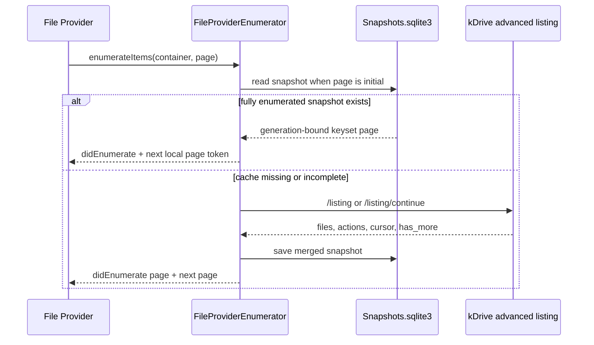

# Listing And Versioning

Listing is the most important bridge between Apple's File Provider model and
kDrive. Apple asks the extension for pages, sync anchors, and changes. The
extension maps those requests to kDrive listing APIs and stores metadata
snapshots in SQLite.

## Container Split

The enumerator chooses one of two strategies.

Normal folders:

- File Provider identifier is a positive kDrive item ID.
- The identifier is accepted as a container only after cached or remote metadata
  confirms that the item is a directory. Documents are rejected with the
  supported File Provider `.noSuchItem` code and a not-a-container reason.
- Uses kDrive advanced listing.
- Can serve a fully enumerated folder from SQLite without a server call.
- Uses the kDrive advanced listing cursor as sync anchor once the snapshot is
  fully enumerated.

Special containers:

- `.rootContainer`
- `.workingSet`
- `.trashContainer`

Root and trash use legacy listing and local snapshot diffs. The working set has
its own durable polling and change-log path described below.

## Normal Folder `enumerateItems`

For initial pages, the enumerator first checks SQLite. If a snapshot is fully
enumerated, it returns at most 200 cached items and a token containing the
generation and final position. Later pages continue that immutable generation,
even if a newer generation becomes active. A token older than the retained
active-plus-two window fails with `.syncAnchorExpired` so File Provider restarts.

When no complete cache exists, the enumerator calls:

- first page: advanced directory listing
- following pages: advanced directory listing continuation

Fetched `files` are merged into the existing snapshot. When `hasMore == false`,
the snapshot is marked fully enumerated.

## Special Container `enumerateItems`

Root calls `listDirectory(...)` on the configured root file ID. Trash calls
`listTrash(...)`.

The working set is the union of children of materialized containers,
materialized files, favorites, files shared by or with the user, and the latest
200 modified items. It is read from the durable working-set state after a
throttled remote poll.

These paths do not reuse fully enumerated snapshots for display. They still save
snapshots for later local diffing during `enumerateChanges`.

## Sync Anchors

Apple calls `currentSyncAnchor` to ask what version of a container the extension
can diff from.

Normal folders return an anchor only when all are true:

- snapshot exists
- `usesAdvancedListing == true`
- `isFullyEnumerated == true`
- `serverCursor` exists

The returned anchor is the advanced-listing `serverCursor`.

Special containers return the local snapshot `anchor`. That anchor is generated
locally and only proves that the saved snapshot matches a previous local view.

## Normal Folder `enumerateChanges`

For advanced folders, Apple passes the sync anchor back to
`enumerateChanges(from:)`. The enumerator verifies that the SQLite snapshot is
fully enumerated and that `snapshot.serverCursor` matches the requested anchor.

Then it calls advanced listing continuation and reduces returned actions:

- delete actions remove item identifiers
- update actions produce updated `FileProviderItem` values when `actions_files`
  includes metadata
- unknown actions and update actions without metadata fail the change pass
- invalid cursors trigger a full rebuild and local diff against the old snapshot

The updated snapshot is saved back to SQLite with a conditional write that must
still match the old anchor and server cursor. Only after that guarded save
succeeds does Apple receive `didUpdate(...)`, `didDeleteItems(...)`, and
`finishEnumeratingChanges(...)`.

If kDrive returns an invalid advanced change payload, the extension fails closed
with `.syncAnchorExpired` instead of advancing the cursor. File Provider can then
restart enumeration from a fresh baseline.

## Special Container `enumerateChanges`

For root and trash, the enumerator:

1. Reads the old SQLite snapshot.
2. Checks whether the requested local anchor matches the snapshot anchor.
3. Lists all current items through the legacy listing path.
4. Builds a new snapshot.
5. Atomically commits the new immutable generation.
6. Reads updates and deletions from SQLite in bounded pages of 200.

Change-page anchors encode the retained source and target generations, the
update/delete phase, and last scanned item ID. File Provider receives
`moreComing == true` until the page token advances to the target anchor. Missing
source or target generations fail with `.syncAnchorExpired` rather than silently
treating an unknown anchor as an empty baseline.

If the old anchor does not match, the baseline is treated as missing and the
diff reports current items as updates.

Legacy listing loops are also validated. A repeated cursor or `hasMore == true`
without a continuation cursor fails the sync attempt with `.cannotSynchronize`
instead of committing a partial listing.

## Working Set And Remote Polling

`materializedItemsDidChange` completes promptly, then enumerates
`NSFileProviderManager.enumeratorForMaterializedItems()` in the background. The
extension persists both materialized directories and individual files.

While the extension is alive it polls at most once per domain every 60 seconds.
Working-set enumeration also performs the same throttled check. A poll:

1. Continues the advanced cursor for each materialized directory.
2. Checks materialized and relevant files through `/files/listing/partial`.
3. Refreshes latest, favorite, my-shared, and shared-with-me membership.
4. Atomically saves every materialized-container snapshot and cursor together
   with the working-set view, change batch, anchor, and successful poll
   watermark. A later poll step failing cannot advance a container cursor past
   changes that were never published to File Provider.
5. Signals only `.workingSet` when remote changes were found.

Advanced actions are mapped newest-first before reduction. A move is included
when either the old or new parent is materialized. For `file_move_out`, the
provider resolves current metadata so File Provider sees a reparenting update,
not a false deletion.

The durable change log retains 32 poll batches so several polls can be reduced
from an older valid working-set anchor. Older anchors expire. Because this is a
client-polling design, remote changes may remain undiscovered while the app and
extension are suspended; push notifications are intentionally outside 0.2.0.

## Cursor And Action Validation

`KDriveListingValidator` owns the fail-closed listing rules:

- `hasMore == true` must include a non-empty continuation cursor.
- a continuation cursor must not repeat the current cursor or a cursor already
  seen in the same rebuild/list-all loop.
- advanced actions must be known delete or update actions.
- delete actions may omit `actions_files` metadata.
- the newest effective update action must include matching item metadata;
  metadata is not required for an older action superseded by a newer delete.

`KDriveAdvancedActionReducer` throws when those rules are violated. This keeps
the stored server cursor tied to a completely understood snapshot state.

## Guarded Snapshot Writes

`KDriveSnapshotStoring` supports conditional saves through
`KDriveSnapshotSaveCondition`:

- `.missing` creates a snapshot only if no row currently exists.
- `.matching(anchor:serverCursor:)` replaces a snapshot only if the stored row
  still has the expected local anchor and server cursor.
- `.unconditional` preserves the previous save behavior for callers that
  intentionally do not need a guard.

Enumeration and change paths use guarded saves before emitting File Provider
changes. If another enumerator has already advanced the same container,
`KDriveSnapshotStoreError.staleSnapshot` is mapped to `.cannotSynchronize`; the
stale writer does not overwrite newer cache state.

## Snapshot Metadata

`KDriveSnapshot` stores:

- `anchor`: local anchor used by legacy diff paths and as fallback identifier
- `serverCursor`: kDrive advanced listing cursor for normal folders
- `isFullyEnumerated`: whether all pages have been fetched
- `usesAdvancedListing`: whether this snapshot came from advanced listing
- `items`: cached `KDriveRemoteItem` metadata

## Item Version Mapping

`FileProviderItem` maps `KDriveRemoteItem` into `NSFileProviderItemVersion`:

- `contentVersion`: `modifiedAt.timeIntervalSince1970`
- `metadataVersion`: `id`, `updatedAt`, `name`, and `parentID`

This is a lightweight versioning scheme. The extension compares the File
Provider `baseVersion` with freshly fetched kDrive metadata before content,
metadata, trash, and delete mutations.

Stale content replacement preserves both by uploading the local bytes as a
renamed conflict copy. Stale rename, move, trash, and permanent delete requests
are blocked before the server is mutated. See [Conflicts](CONFLICTS.md) for the
remaining limitations.
