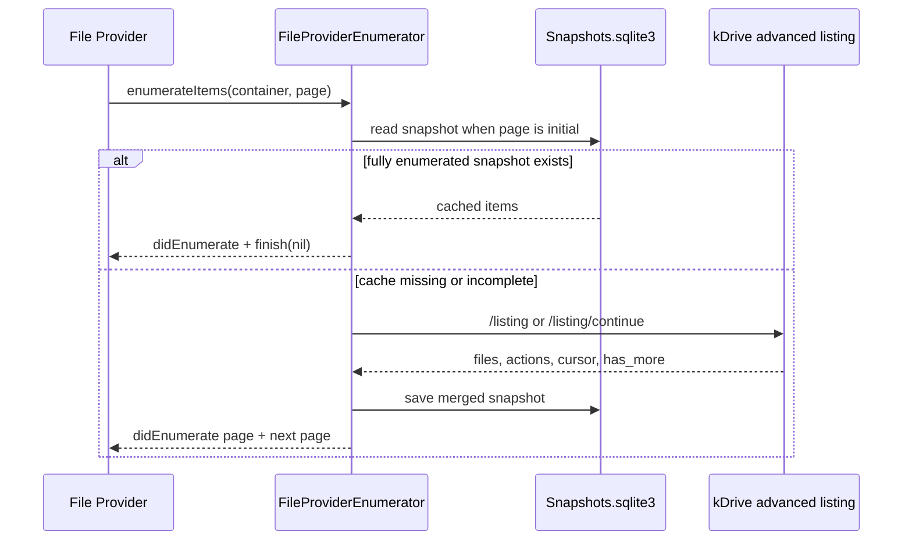

# Listing And Versioning

Listing is the most important bridge between Apple's File Provider model and
kDrive. Apple asks the extension for pages, sync anchors, and changes. The
extension maps those requests to kDrive listing APIs and stores metadata
snapshots in SQLite.

## Container Split

The enumerator chooses one of two strategies.

Normal folders:

- File Provider identifier is a positive kDrive item ID.
- Uses kDrive advanced listing.
- Can serve a fully enumerated folder from SQLite without a server call.
- Uses the kDrive advanced listing cursor as sync anchor once the snapshot is
  fully enumerated.

Special containers:

- `.rootContainer`
- `.workingSet`
- `.trashContainer`

These do not use advanced listing today. Root and working set call legacy
directory listing for the configured root file ID. Trash calls kDrive trash
listing. Changes are produced by local diffing against the last SQLite snapshot.

## Normal Folder `enumerateItems`

For initial pages, the enumerator first checks SQLite. If a snapshot has
`usesAdvancedListing == true` and `isFullyEnumerated == true`, it returns cached
items and does not call kDrive.

When no complete cache exists, the enumerator calls:

- first page: advanced directory listing
- following pages: advanced directory listing continuation

Fetched `files` are merged into the existing snapshot. When `hasMore == false`,
the snapshot is marked fully enumerated.

## Special Container `enumerateItems`

Root and working set call `listDirectory(...)` on the configured root file ID.
Trash calls `listTrash(...)`.

These paths do not reuse fully enumerated snapshots for display. They still save
snapshots for later local diffing during `enumerateChanges`.

## Sync Anchors

Apple calls `currentSyncAnchor` to ask what version of a container the extension
can diff from.

Normal folders return an anchor only when all are true:

- snapshot exists
- `usesAdvancedListing == true`
- `isFullyEnumerated == true`
- `serverCursor` exists

The returned anchor is the advanced-listing `serverCursor`.

Special containers return the local snapshot `anchor`. That anchor is generated
locally and only proves that the saved snapshot matches a previous local view.

## Normal Folder `enumerateChanges`

For advanced folders, Apple passes the sync anchor back to
`enumerateChanges(from:)`. The enumerator verifies that the SQLite snapshot is
fully enumerated and that `snapshot.serverCursor` matches the requested anchor.

Then it calls advanced listing continuation and reduces returned actions:

- delete actions remove item identifiers
- update actions produce updated `FileProviderItem` values when `actions_files`
  includes metadata
- missing update metadata is ignored while cursor progress still continues
- invalid cursors trigger a full rebuild and local diff against the old snapshot

The updated snapshot is saved back to SQLite and Apple receives
`didUpdate(...)`, `didDeleteItems(...)`, and `finishEnumeratingChanges(...)`.

## Special Container `enumerateChanges`

For root, working set, and trash, the enumerator:

1. Reads the old SQLite snapshot.
2. Checks whether the requested local anchor matches the snapshot anchor.
3. Lists all current items through the legacy listing path.
4. Builds a new snapshot.
5. Diffs old versus new with `KDriveSnapshotDiffer`.
6. Saves the new snapshot and emits updates/deletes.

If the old anchor does not match, the baseline is treated as missing and the
diff reports current items as updates.

## Snapshot Metadata

`KDriveSnapshot` stores:

- `anchor`: local anchor used by legacy diff paths and as fallback identifier
- `serverCursor`: kDrive advanced listing cursor for normal folders
- `isFullyEnumerated`: whether all pages have been fetched
- `usesAdvancedListing`: whether this snapshot came from advanced listing
- `items`: cached `KDriveRemoteItem` metadata

## Item Version Mapping

`FileProviderItem` maps `KDriveRemoteItem` into `NSFileProviderItemVersion`:

- `contentVersion`: `modifiedAt.timeIntervalSince1970`
- `metadataVersion`: `id`, `updatedAt`, `name`, and `parentID`

This is a lightweight versioning scheme. The extension currently logs the
`baseVersion` passed into mutations but does not use it to reject stale writes.
See [Conflicts](CONFLICTS.md) for the implications.
